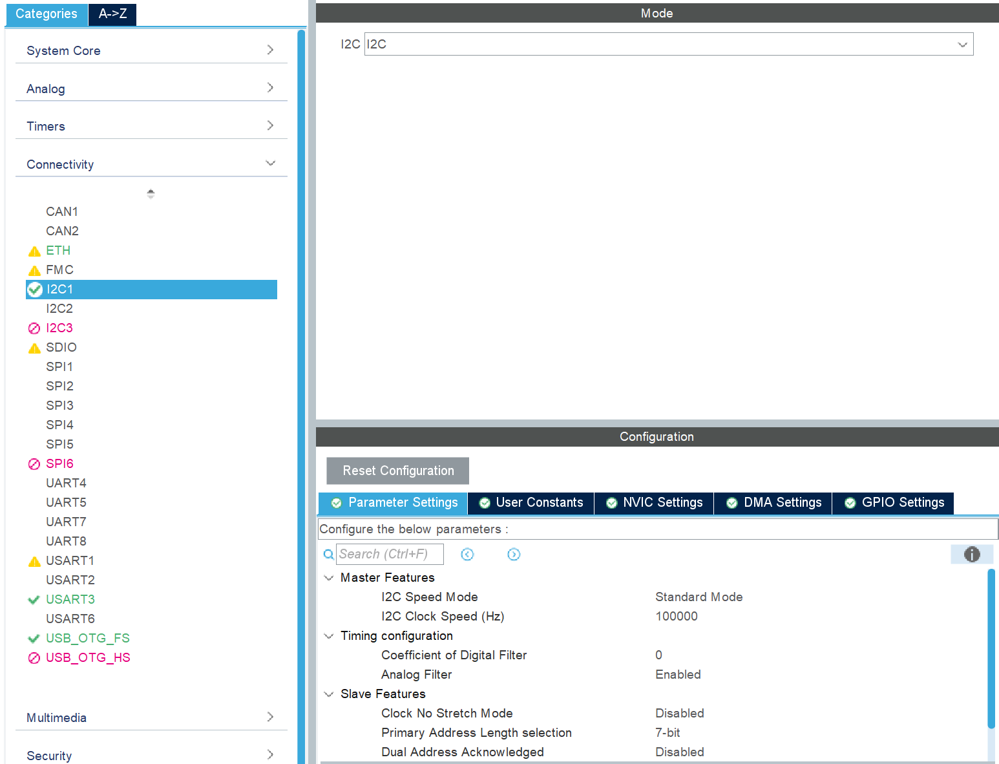
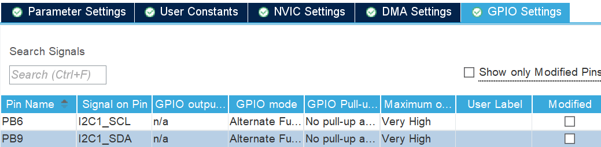
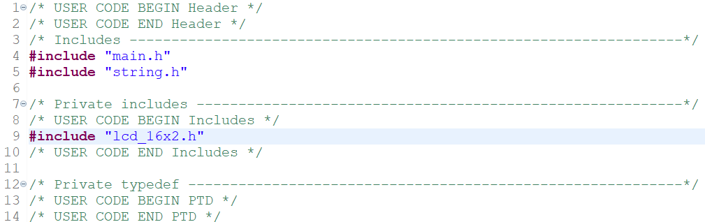
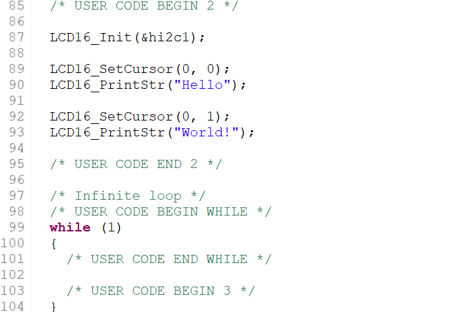

# STM32 LCD 16x2 I2C Library

A lightweight, easy-to-use 16x2 LCD library for STM32 (HAL-based), using I2C via PCF8574 I/O expander.\
This project includes ready-to-use examples you can paste directly into your `main.c`.

---

## Directory Structure

```
STM32_LCD16x2/
├── src/              # Core LCD library
│   ├── lcd_16x2.c
│   └── lcd_16x2.h
└── example/          # LCD usage examples (ready to copy-paste)
    ├── hello_world.c
    ├── scroll.c
    └── cursor.c
```

---

## How to Use

### 1. Enable I2C in CubeMX

- Enable I2C (e.g., I2C1) from the **Connectivity > I2C1** menu
- Keep default settings (standard mode 100kHz, 7-bit addressing)



### 2. Assign GPIO Pins for I2C

- Assign `PB6` to `I2C1_SCL`
- Assign `PB9` to `I2C1_SDA`
- Set GPIO speed to Very High, and leave pull-up/down as `No pull-up and no pull-down`



### 3. Add Library to Your STM32 Project

- Copy `src/lcd_16x2.c` to `Core/Src/`
- Copy `src/lcd_16x2.h` to `Core/Inc/`


- Include the header in your `main.c`:



  ```c
  #include "lcd_16x2.h"
  ```

### 4. Add LCD code to `main.c`

Paste the following code in the user code sections to initialize the LCD and display text:



---

## Examples

All examples are designed to be copy-pasted into `main.c`, inside:

- `/* USER CODE BEGIN Includes */`
- `/* USER CODE BEGIN 2 */`
- `/* USER CODE BEGIN WHILE */`

### Example: Hello World (`example/hello_world.c`)

This example demonstrates a basic test to verify LCD communication.

Paste the following in:
- `/* USER CODE BEGIN Includes */`
  ```c
  #include "lcd_16x2.h"
  ```
- `/* USER CODE BEGIN 2 */`
  ```c
  LCD16_Init(&hi2c1);
  LCD16_SetCursor(0, 0);
  LCD16_PrintStr("Hello");
  LCD16_SetCursor(0, 1);
  LCD16_PrintStr("World!");
  ```

---

## I2C Address Notes

The default I2C address used by the library is:

```c
#define LCD_I2C_ADDR (0x3F << 1)  // = 0x7E
```

This value assumes that your LCD module is using a PCF8574 I/O expander with address `0x3F` (a common default).

### Why Shift Left by 1?
STM32 HAL functions such as `HAL_I2C_Master_Transmit()` require an **8-bit address** format. I2C device addresses are usually specified in 7-bit form, so we shift the address one bit to the left to make it 8-bit.

| 7-bit Address | Shifted 8-bit Address |
|---------------|------------------------|
| 0x3F          | 0x7E                   |
| 0x27          | 0x4E                   |

### How to Determine Your LCD Address
- Check your module datasheet or the label on the PCF8574 chip
- Use an I2C scanner (sample code available online) to detect devices on the bus

If needed, update the macro in `lcd_16x2.h`:
```c
#define LCD_I2C_ADDR (0x27 << 1)  // for modules using address 0x27
```

---

## Available Functions

Below is a list of public functions provided by the LCD library (`lcd_16x2.h`):

| Function | Description |
|---------|-------------|
| `LCD16_Init(I2C_HandleTypeDef *hi2c)` | Initializes the LCD module (4-bit, 2-line mode). |
| `LCD16_Clear(void)` | Clears the display and resets cursor position. |
| `LCD16_SetCursor(uint8_t col, uint8_t row)` | Sets the cursor to a specific column and row. |
| `LCD16_DisplayOn(void)` | Turns the LCD display on. |
| `LCD16_DisplayOff(void)` | Turns the LCD display off. |
| `LCD16_ShowCursor(void)` | Shows the blinking cursor. |
| `LCD16_HideCursor(void)` | Hides the cursor. |
| `LCD16_BlinkCursor(void)` | Enables cursor blinking. |
| `LCD16_StopBlink(void)` | Disables cursor blinking. |
| `LCD16_PrintStr(const char *str)` | Prints a string starting from the current cursor position. |

---

## License

MIT License — Free to use and modify.

---

Happy coding with your STM32 + LCD!

